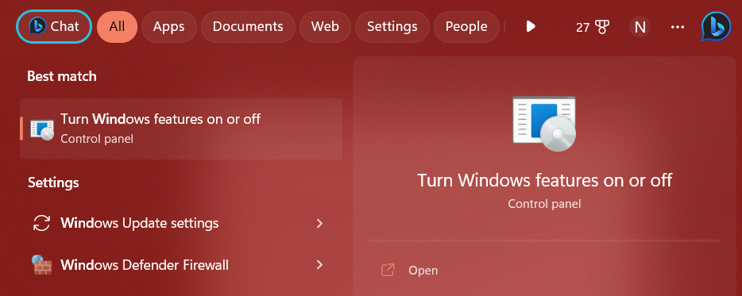
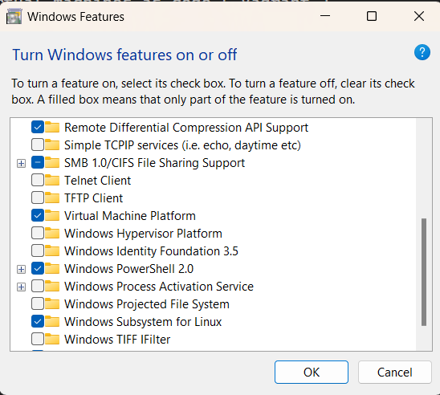

# Solution before docker
- configuration managment tools (chef, puppet, ansible)
    - require knowledge about hardware and operating systems.
- virtual machines as code ( Vagrant )
    - heavy, slow-ish, requires inconvenient configuration.

# Docker solved : 👇

- Dockers makes containers easy:
    - Configuration through Dockerfiles, not shell commands.
    - Share image with others through image registries.
    - A super easy command line client and API.

# Docker explained

- #### Containers vs virtual machines
| Containers                        | Virtual Machines              |
| -------------                     |-----------------------------  |
| Run in container runtimes         | Run on top of hypervisors     |
| work alongside operating system   | Need hardware emulation       |
| Do not require OS configuration   | Require OS configuration      |
| Run one app at a time ( usually ) | Can run many apps at a time   |

- #### Containers runtime:
    The container runtime is the low-level component that creates and runs containers. Docker currently uses runC, the most popular runtime, which adheres to the OCI standard that defines container image formats and execution. However, because Docker observes OCI-compliance, any OCI-compliant runtime should work.

    - ###### OCI runtimes
        - Open container initiative ( OCI ).
        - OCI aims to stand
        ardize container technology, like container images and runtimes.
        - The OCI runtime specification outlines what a container

    - ###### CRI runtimes
        - Container runtime interface ( CRI ).
        - CRI provides an API for running containers on container runtimes.
        - This allows projects like kubernetes to not to be tied to any specific or runtime standard.

- #### Docker Engine: 
    - Most popular container engine.
    - Comes with the docker command-line tool.
    - Also comes with a REST-based API for managing containers and a DSL for creating container images called Dockerfile.
    - Uses containerd as its runtime by default.

# Installation:
-   Steps:
    - Search:
         
        Choose virtual machine plateform and windows subsystem for linux (wsl) > click OK
        
        
    - Restart the system > open command shell write "wsl --update" > write "wsl --shutdown".

    - To find available linux distribution 
        ```
            wsl --list --online
        ```
    - Install ubuntu:
        ```
            wsl --install -d ubuntu
        ```
    - Create your username and password.

            OR

- window user visit https://docs.docker.com/desktop/install/windows-install/
- Mac user visit https://docs.docker.com/desktop/install/mac-install/